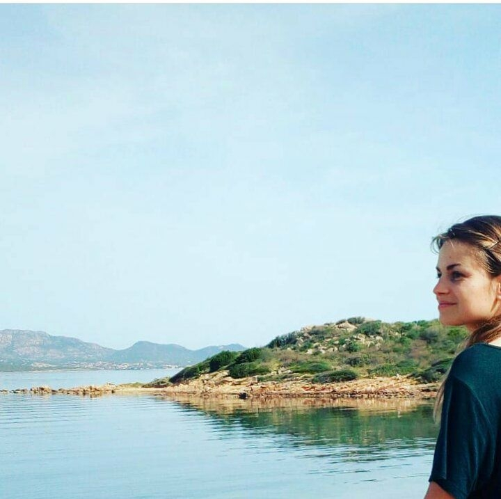

# Mon CV en quelques lignes

***

## Présentation

Actuellement en formation intensive à la Wild Code School de Strasbourg, j'apprends à développer en PHP mais aussi beaucoup d'autres choses pour être dans quelques semaine Developpeuse Web.  
Vous trouverez sur mon GitHub quelques uns de mes projets personnels et scolaires. 
**Bonne visite !**

***

## Mes formations

- sept 2020 - fev 2021 (en cours) : **Developpeuse web et web mobile**. _Wild Code School. Strasbourg._

- mai 2020 - sept 2020 : **Developpement web en autodidacte** . _OpenClassrooms & Co._

***

## Mon expérience 

- **Projet 2 (en cours)**: création d'un site web pour un groupe de musique avec boutique, agenda et envoi de newletters. Session utilisateur pour suivi commandes et autres information personnelles et administrateur pour modification de données sur le site et visualisation de informations utilisateurs.  
_HTML - Bootstrap - PHP - Twig - MySQL_

- **Projet 1**: Création d'un CV en ligne pour un personnage fictif.  
_HTML - CSS - MySQL (PDO) - PHP_  
[Pour découvrir le projet](https://github.com/AlineDenizot/schoolprojet1)

- Autres petits **projets personnels**
_JS - Intégration_

***

## Mes autres passions

J'occupe mes temps libres avec beaucoup de bricolages, quelques balades, un peu de lecture et pas mal de séries. 

#### Pour plus de détails sur mon parcours, [retrouvez-moi sur Linkedin](https://www.linkedin.com/in/a-denizot/)

